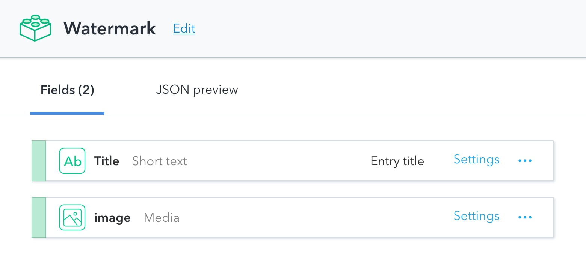

# serverless-contentful-watermark

A serverless function to create Contentful images with watermarks


## How to get started

This project is built using the [serverless framework](https://www.serverless.com). You can find all the configuration needed for the function included in this project in the `serverless.yml`.

### Install all dependencies

Thanks to the serverless project it is possible to include npm dependencies. Serverless will pick and pack the files it needs when you later deploy your function to AWS.

```
$ git clone git@github.com:stefanjudis/serverless-contentful-watermark.git
$ cd serverless-contentful-watermark
$ npm install
```

### Define environment variables

To upload watermarked images automatically you have to define the following environment variables in the session of your terminal.

```
export SPACE_ID=...
export CDA_ACCESS_TOKEN=...
export CMA_ACCESS_TOKEN=...
export WATERMARK_CONFIG_ID=...
```

Space ID, CDA and CMA access token are used to fetch and upload data and images.

#### The configuration content type

To keep this watermarker flexible the project relies on one entry stored in Contentful. This way you can change the watermark logo right inside of Contentful without the need to redeploy your serverless function.



### Spin up the local development mode

```
$ npm run dev
```

## How to deploy to AWS
